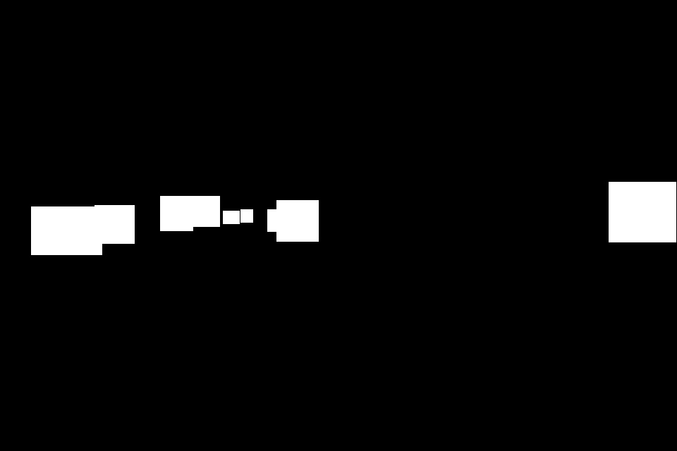
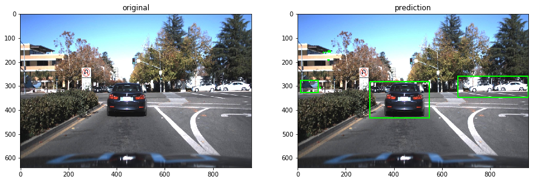
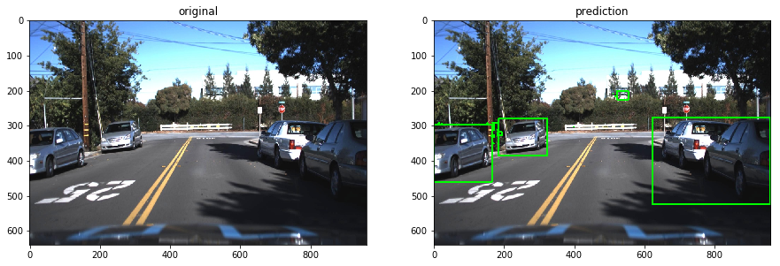
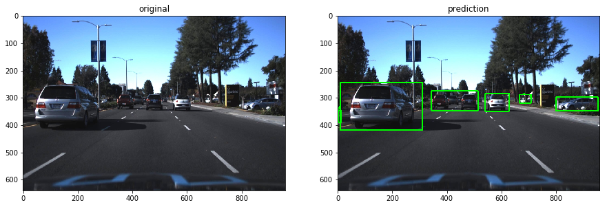
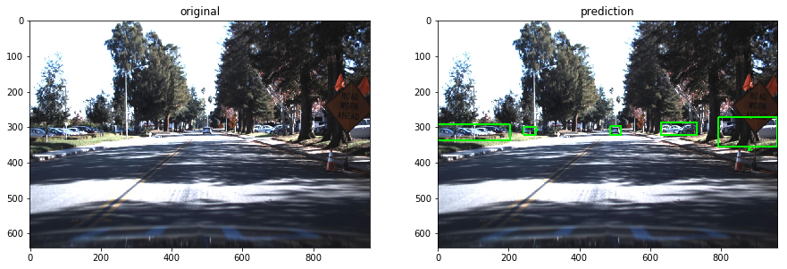
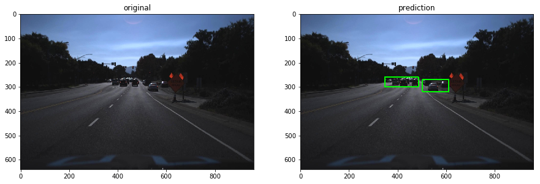
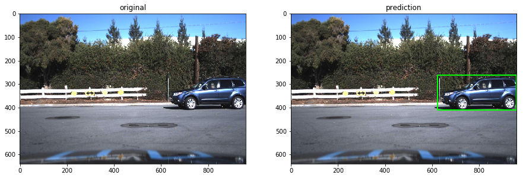

# U-Net Implementation in TensorFlow


Re implementation of U-Net in Tensorflow
- to check how image segmentations can be used for detection problems

Original Paper
- [U-Net: Convolutional Networks for Biomedical Image Segmentation](https://arxiv.org/abs/1505.04597)

## Summary

Vehicle Detection using U-Net

Objective: detect vehicles
Find a function f such that y = f(X)
<table>
    <tr>
        <th>Input</th>
        <th>Shape</th>
        <th>Explanation</th>
        <th>Example</th>
    </tr>
    <tr>
        <td>X: 3-D Tensor</td>
        <td>(640, 960, 3)</td>
        <td>RGB image in an array</td>
        <td></td>
    </tr>
    <tr>
        <td>y: 3-D Tensor</td>
        <td>(640, 960, 1)</td>
        <td>Binarized image. Bacground is 0<br />vehicle is masked as 255</td>
        <td></td>
    </tr>
</table>

Loss function: maximize IOU
```
    (intersection of prediction & grount truth)
    -------------------------------------------
    (union of prediction & ground truth)
```

### Examples on Test Data: trained for 3 epochs









## Get Started

### Download dataset

- the annotated driving dataset is provided by [Udacity](https://github.com/udacity/self-driving-car/tree/master/annotations)
- In total, 9,423 frames with 65,000 labels at 1920x1200 resolution.

```bash
make download
```

### Resize image and generate mask images

- [utils/data.py](./utils/data.py) is used to resize images and generate masks

```bash
make generate
```

### Train Test Split

Make sure masks and bounding boxes

```bash
jupyter notebook "Visualization & Train Test Split.ipynb"
```

### Train

```bash
# Train for 1 epoch
python train.py
```

or

```bash
$ python train.py --help
usage: train.py [-h] [--epochs EPOCHS] [--batch-size BATCH_SIZE]
                [--logdir LOGDIR] [--reg REG] [--ckdir CKDIR]

optional arguments:
  -h, --help            show this help message and exit
  --epochs EPOCHS       Number of epochs (default: 1)
  --batch-size BATCH_SIZE
                        Batch size (default: 4)
  --logdir LOGDIR       Tensorboard log directory (default: logdir)
  --reg REG             L2 Regularizer Term (default: 0.1)
  --ckdir CKDIR         Checkpoint directory (default: models)
```

### Test

- Open the Jupyter notebook file to run against test data

```bash
jupyter notebook "./Test Run After Training.ipynb"
```
